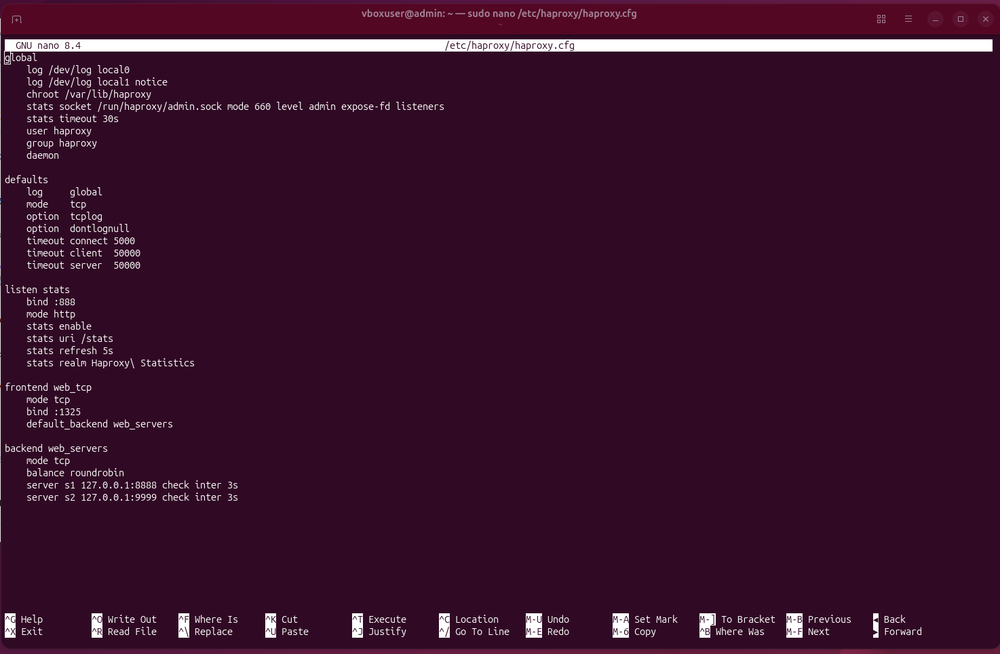
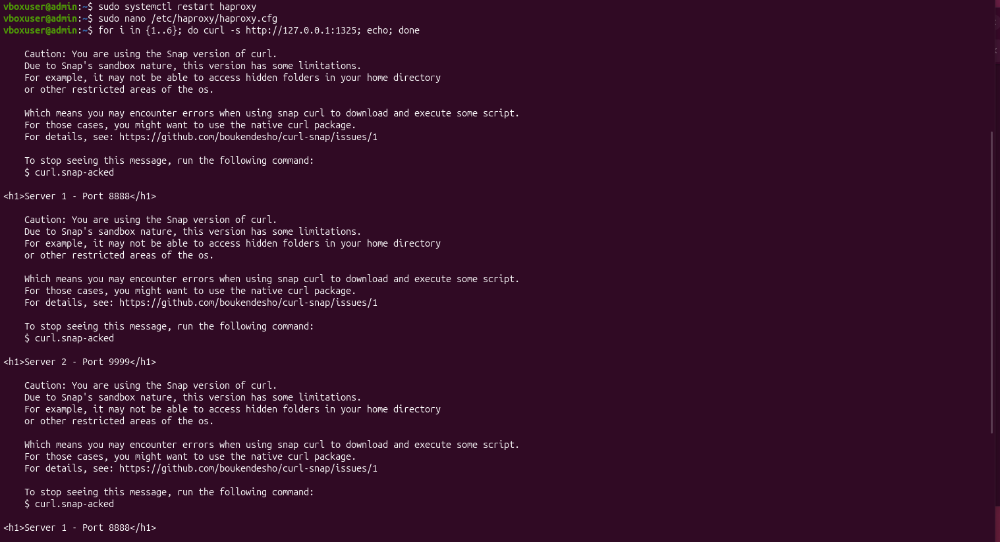
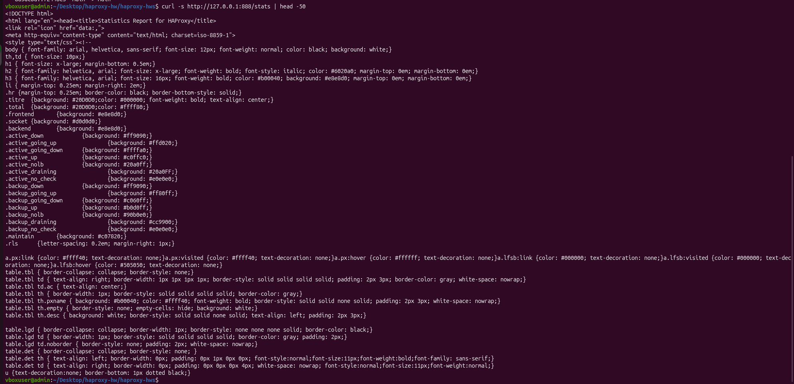
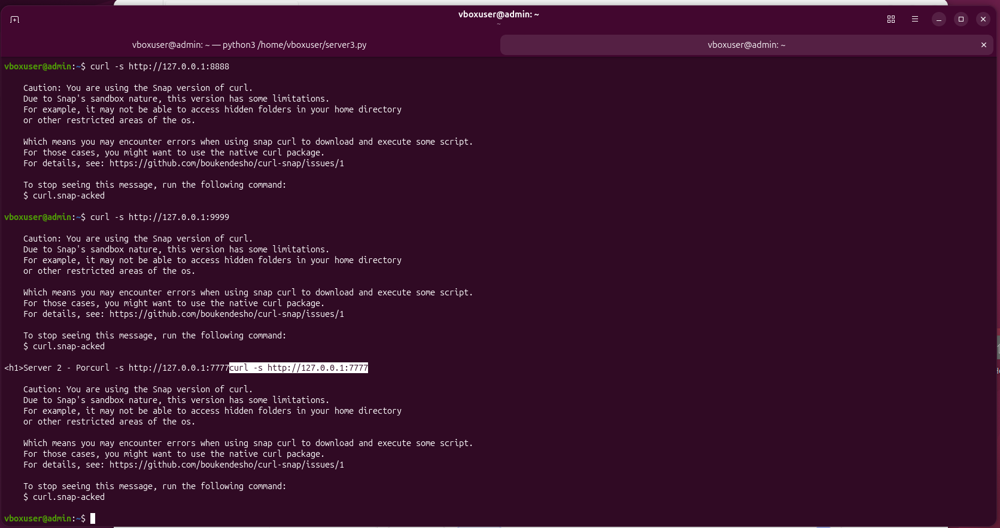
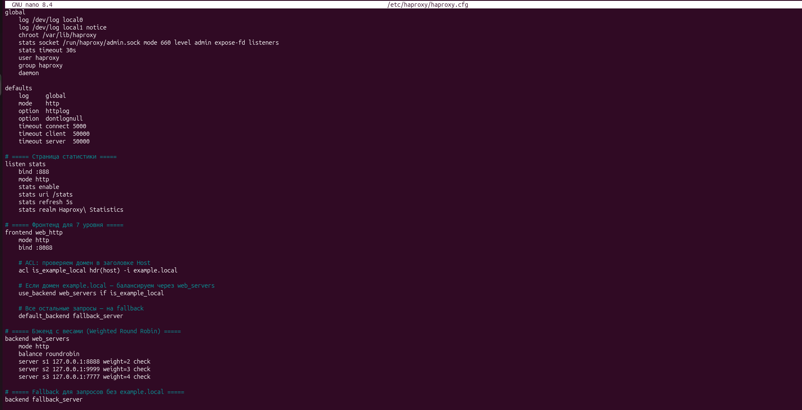
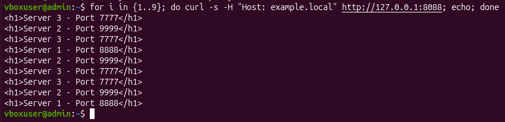

# Домашнее задание к занятию "Кластеризация и балансировка нагрузки" - Письменный Никита Николаевич

## Задание 1

Приведите ответ в свободной форме.

### Этапы выполнения

1. Созданы два простых Python-сервера на портах **8888** и **9999** с использованием стандартного модуля `http.server`.
2. Установлен и запущен **HAProxy** на виртуальной машине с Ubuntu.
3. Настроена балансировка **Round-robin на 4 уровне** (TCP): фронтенд слушает порт **1325**, бэкенд распределяет запросы между двумя серверами.
4. Проверка балансировки выполнена **изнутри виртуальной машины** через `curl` — запросы поочерёдно направляются то на Server 1 (8888), то на Server 2 (9999).
5. Страница статистики HAProxy проверена **локально изнутри Ubuntu** через `curl http://127.0.0.1:888/stats` — проброс портов виртуальной машины не выполнялся, так как для учебного проекта это не требуется. Скриншот из браузера не делался; вместо него использовалась проверка изнутри виртуалки.

### Конфигурационный файл `/etc/haproxy/haproxy.cfg`

```haproxy
global
    log /dev/log local0
    log /dev/log local1 notice
    chroot /var/lib/haproxy
    stats socket /run/haproxy/admin.sock mode 660 level admin expose-fd listeners
    stats timeout 30s
    user haproxy
    group haproxy
    daemon

defaults
    log     global
    mode    tcp
    option  tcplog
    option  dontlognull
    timeout connect 5000
    timeout client  50000
    timeout server  50000

listen stats
    bind :888
    mode http
    stats enable
    stats uri /stats
    stats refresh 5s
    stats realm Haproxy\ Statistics

frontend web_tcp
    mode tcp
    bind :1325
    default_backend web_servers

backend web_servers
    mode tcp
    balance roundrobin
    server s1 127.0.0.1:8888 check inter 3s
    server s2 127.0.0.1:9999 check inter 3s
```

### Проверка балансировки

Команда:
```bash
for i in {1..6}; do curl -s http://127.0.0.1:1325; echo; done
```

Результат — поочерёдное чередование ответов от Server 1 и Server 2:

```
<h1>Server 1 - Port 8888</h1>
<h1>Server 2 - Port 9999</h1>
<h1>Server 1 - Port 8888</h1>
<h1>Server 2 - Port 9999</h1>
<h1>Server 1 - Port 8888</h1>
<h1>Server 2 - Port 9999</h1>
```

### Скриншоты

**Пример вставки скриншота в Markdown:**

```markdown

```

**Скриншот 1 — конфигурационный файл HAProxy для Задания 1:**



**Скриншот 2 — чередование запросов Round-robin на 4 уровне (порт 1325):**



**Скриншот 3 — страница статистики, полученная через curl изнутри Ubuntu:**



---

## Задание 2

Приведите ответ в свободной форме.

### Этапы выполнения

1. Запущен третий Python-сервер на порту **7777** (в дополнение к уже работающим 8888 и 9999).
2. Настроена балансировка **Weighted Round Robin на 7 уровне** (HTTP): `mode http`, `balance roundrobin`.
3. Заданы веса серверов: **Server 1 — 2**, **Server 2 — 3**, **Server 3 — 4**.
4. Настроен **ACL по домену `example.local`** — балансировка применяется только к HTTP-трафику, адресованному этому домену.
5. Для запросов без указанного домена настроен **fallback-бэкенд**, направляющий всё на Server 1.
6. Проверка выполнена изнутри виртуальной машины с подменой заголовка `Host` через `curl -H "Host: example.local"`.

### Конфигурационный файл `/etc/haproxy/haproxy.cfg`

```haproxy
global
    log /dev/log local0
    log /dev/log local1 notice
    chroot /var/lib/haproxy
    stats socket /run/haproxy/admin.sock mode 660 level admin expose-fd listeners
    stats timeout 30s
    user haproxy
    group haproxy
    daemon

defaults
    log     global
    mode    http
    option  httplog
    option  dontlognull
    timeout connect 5000
    timeout client  50000
    timeout server  50000

listen stats
    bind :888
    mode http
    stats enable
    stats uri /stats
    stats refresh 5s
    stats realm Haproxy\ Statistics

frontend web_http
    mode http
    bind :8088
    acl is_example_local hdr(host) -i example.local
    use_backend web_servers if is_example_local
    default_backend fallback_server

backend web_servers
    mode http
    balance roundrobin
    server s1 127.0.0.1:8888 weight 2 check
    server s2 127.0.0.1:9999 weight 3 check
    server s3 127.0.0.1:7777 weight 4 check

backend fallback_server
    mode http
    server s1 127.0.0.1:8888 check
```

### Проверка балансировки с доменом `example.local`

Команда:
```bash
for i in {1..9}; do curl -s -H "Host: example.local" http://127.0.0.1:8088; echo; done
```

Распределение на 9 запросов (пропорция 2:3:4):

- Server 1 — 2 раза
- Server 2 — 3 раза
- Server 3 — 4 раза

### Проверка без домена (fallback)

Команда:
```bash
for i in {1..3}; do curl -s http://127.0.0.1:8088; echo; done
```

Результат — все запросы уходят на Server 1:

```
<h1>Server 1 - Port 8888</h1>
<h1>Server 1 - Port 8888</h1>
<h1>Server 1 - Port 8888</h1>
```

### Скриншоты

**Скриншот 1 — проверка трёх серверов (8888, 9999, 7777):**



**Скриншот 2 — конфигурационный файл HAProxy для Задания 2:**



**Скриншот 3 — балансировка с example.local (веса 2:3:4):**



**Скриншот 4 — запрос без домена — все на Server 1:**


